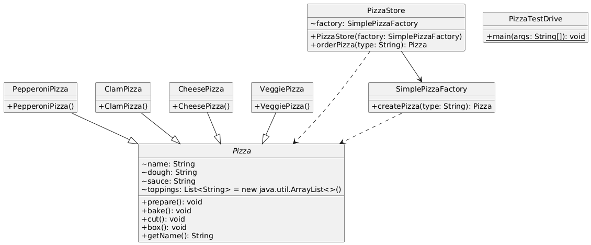
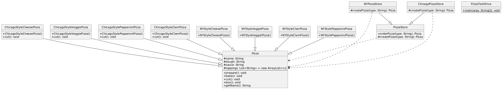
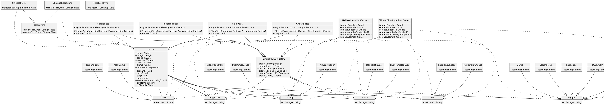

# FACTORY DESIGN PATTERN
- Provides an interface for creating families of related or dependent objects,
- without specifying their concrete classes.

# ABSTRACT FACTORY DESIGN PATTERN
- Defines an interface for creating an object, but let subclasses decide ehich class to instantiate.
- Factory method lets a class defer instantiation to the subclasses.

## Project 1: PizzaStoreV1
- Simple Factory Design Pattern Example
- PizzaStore uses SimplePizzaFactory to create pizzas without exposing instantiation logic.

## Project 2: PizzaStoreV2
- Factory Design Pattern Example
- Subclasses of PizzaStore override createPizza() to produce region-specific pizzas.

## Project 3: PizzaStoreV3
- Abstract Factory Design Pattern Example
- Uses ingredient factories to create families of related pizza ingredients (dough, sauce, etc.) for different regions.

