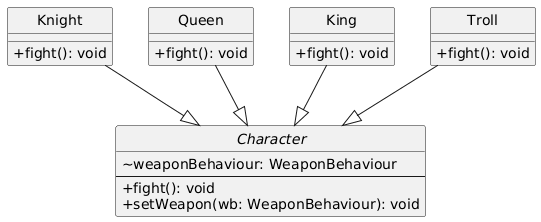
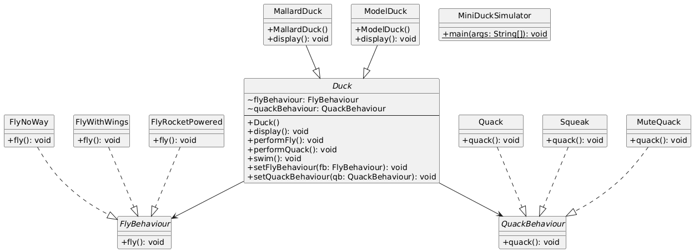

# STRATEGY DESIGN PATTERN
- Defines a family of algorithms, encapsulate each one, and makes them interchangeable.
- Strategy lets the algorithm vary independently from clients that use it.

## Project 1: Adventure Game
- Characters switch weapons dynamically (e.g., Queen uses Sword or Bow).

## Project 2: SimUDuck
- Strategy Design Pattern Example
- Ducks change fly/quack behaviors at runtime (e.g., ModelDuck gains rocket flight).

