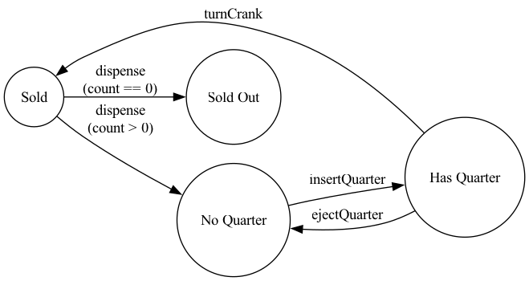
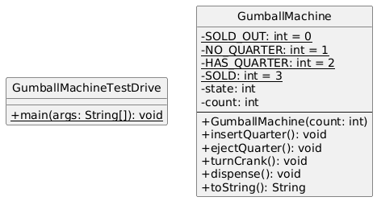
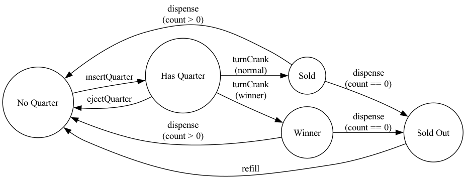

# STATE DESIGN PATTERN
- Allow an object to alter its behaviour when its internal state changes.
- The object will appear to change its class.

## Project 1: GumballV1
- Basic gumball machine implementation without State pattern
- Relying on conditional statements for state transitions.

## Project 2: GumballV2
- State Design Pattern Example
- Implements State pattern with dedicated state classes

