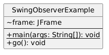
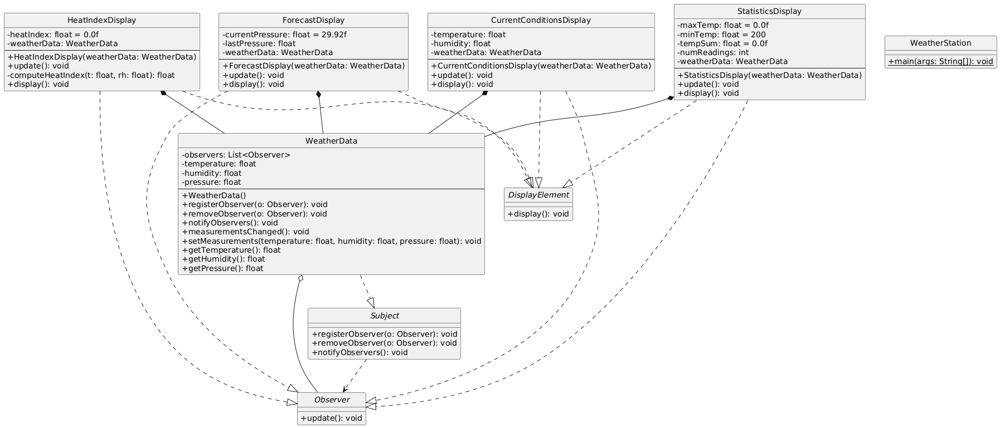

# OBSERVER DESIGN PATTERN
- Defines a one-to-many dependency between objects so that when one object changes state,
- All its dependents are notified and updated automatically.

## Project 1: SwingApp
- Real World Example Project
- Observer pattern in Swing GUI, with components reacting to data changes.

## Project 2: WeatherApp
- Observer Design Pattern Example
- WeatherData subject notifies display observers (current conditions, statistics, forecast, heat index) of measurement updates.

