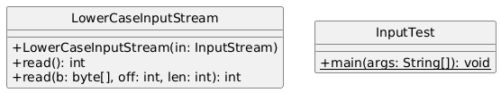
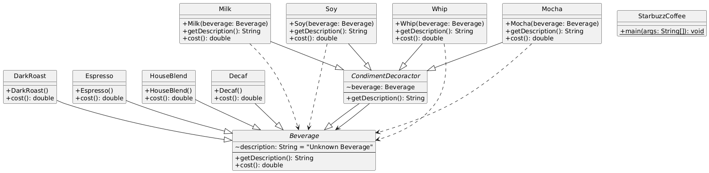

# DECORATOR DESIGN PATTERN
- Attach additional responsibilities to an object dynamically.
- Decorator provide a flexible alternative to subclassing for extending functionality.

## Project 1: IODecorator
### Real World Example Project

## Project 2: Starbuzz
### Decorator Design Pattern Example

