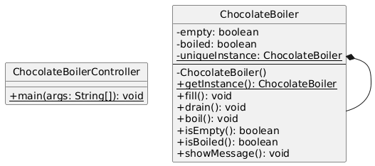
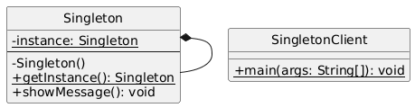
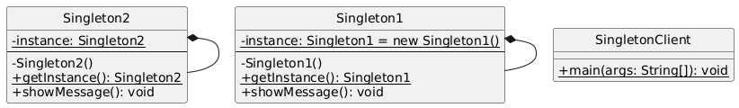

# SINGLETON DESIGN PATTERN
- Ensure a class only has one instance and provide a global point of access to it.

## Project 1: Chocoholic
### Implementing a ThreadSafe ChocolateBoiler

## Project 2: Classic
### Classic Singleton Design Pattern Example

## Project 3: MultiThread
### Multithreaded Singleton Design Pattern Example

## Project 4: MultiThreadOptimized
### Approach1: Eager initialization of the singleton instance
### Approach2: Lazy initialization with double-checked locking
### Approach3: Enum based singleton (best practice for singletons in Java)

