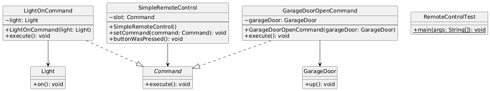
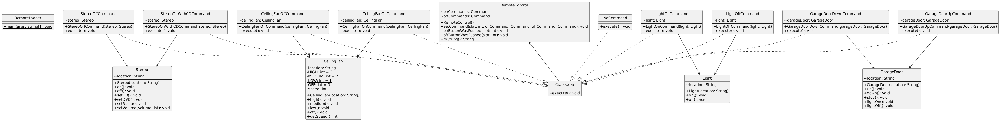
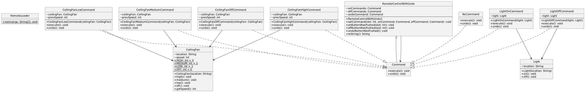
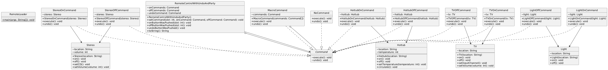
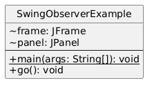

# COMMAND DESIGN PATTERN
- Encapsulates a request as an object to parameterize clients with different requests.
- Supports queuing, logging, and undoable operations.

## Project 1: Simple Remote
- Implement simple command design pattern
- RemoteControl invokes LightOnCommand to turn on a light.

## Project 2: Remote With Slots
- Implement simple remote control plus slots
- Remote control with multiple slots, each holding on/off commands for different devices.

## Project 3: Remote With Slots And Undo
- Implement simple remote control plus slots and undo operation
- Adds undo functionality to commands, allowing reversal of last executed command.

## Project 4: Remote With Slots, Undo and Party mode
- Implement simple remote control plus slots, undo, party mode operation
- Implement party mode using macroCommand (allows to execute multiple commands)

## Project 5: Swing App
- Similar to chapter 2 (An example of both Observer + Command Design pattern)
- Segregated - Client, Commands, Invoker and Receiver.
- Combines Command & Observer patterns in Swing GUI, with buttons(invokers) & menu-items(receivers).

