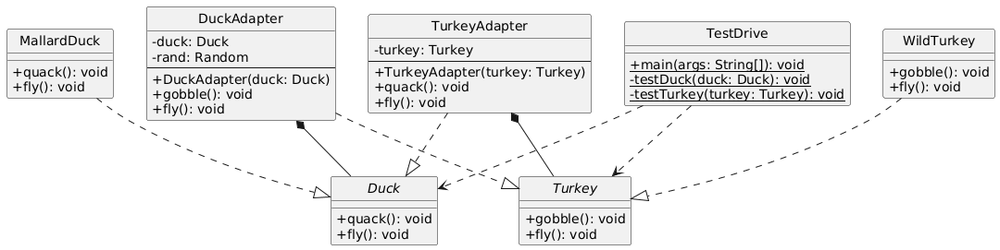
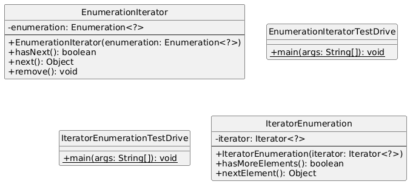
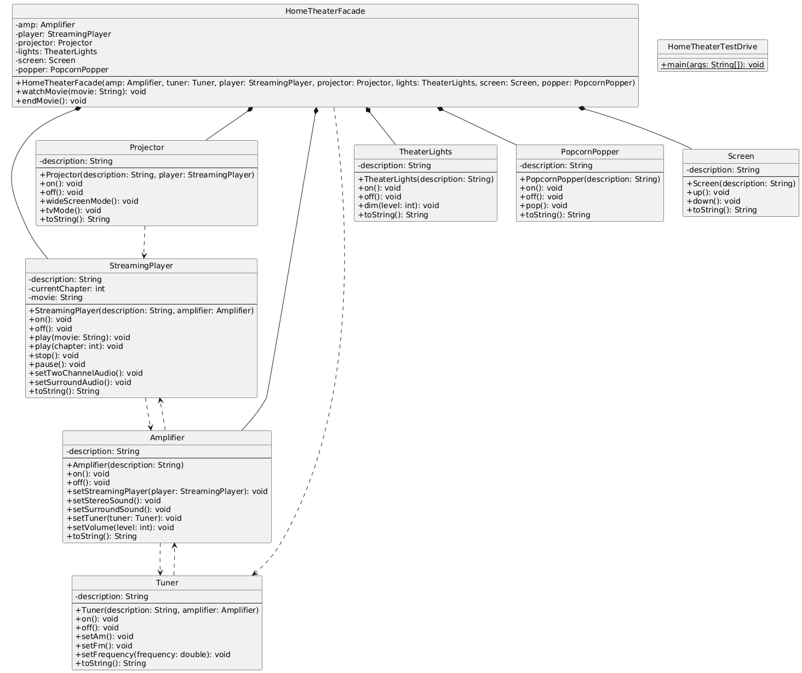

# ADAPTER DESIGN PATTERN
- Converts the interface of a class into another inteface the client expects.
- Adapter lets classes work together that couldn't otherwise because of incompatible intefaces.

## Project 1: Ducks
- Example Project to learn Adapter Design Pattern
- TurkeyAdapter adapts Turkey to Duck interface, allowing Turkey to be used where Duck is expected.

## Project 2: IterEnum
- Real world use case of Adapter Design Pattern (in java collections)
- Used adapters between Iterators(Recent) <-> Enumerators(Legacy)

# FACADE DESIGN PATTERN
- Provides a unified interface to a set of interfaces in a subsystem.
- Facade defines a higher-level inteface that makes the subsystem easier to use.

## Project 3: MyHomeTheater
- Example Project to learn Facade Design Pattern
- Facade pattern: HomeTheaterFacade simplifies control of complex home theater components.

