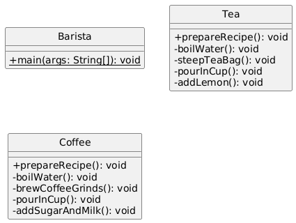
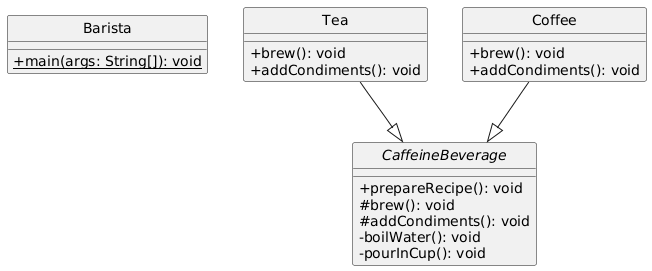
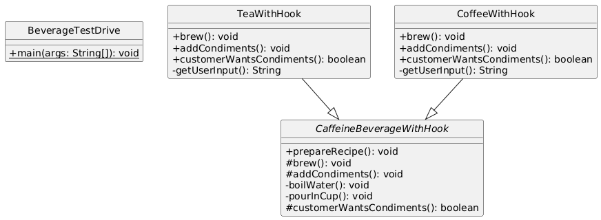
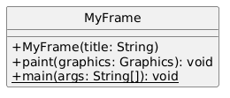
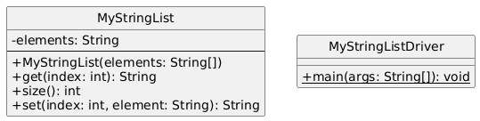
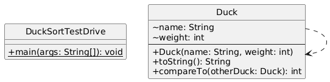

# TEMPLATE METHOD DESIGN PATTERN
- Define the skeleton of an algorithm in an operation, defering some steps to subclasses.
- Template method lets subclasses redefine certain steps of an algorithm without changing the algorithm's structure.

## Project 1: BaristaV1
- Simple vanilla barista project without any design pattern used
- CaffeineBeverage defines prepareRecipe(), subclasses implement brew() and addCondiments().

## Project 2: BaristaV2
- Example Project to learn Template Method Design Pattern (improvise V1)
- Adds hook methods (e.g., customerWantsCondiments()) for subclass customization.

## Project 3: BaristaV3
- Example Project to learn Template Method Design Pattern with hooks (improvise V2)
- Further hooks for advanced customization in the template method.

## Project 4: Frames
- Real world example of Template Method Design Pattern in GUI's JFrame
- JFrame subclass uses a template method for window handling, with hooks to customize close behavior.

## Project 5: Lists
- Real world example of Template Method Design Pattern in Java Collection (lists)
- Custom list with hook for element processing logic.

## Project 6: Sorting
- Real world example of Template Method Design Pattern in Java Collection (CompareTo & Sort)
- Duck sorting using compareTo() as the primitive operation.

