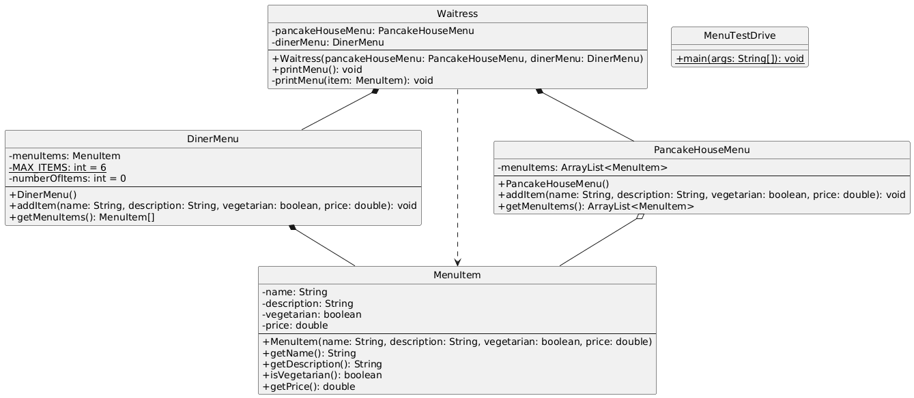
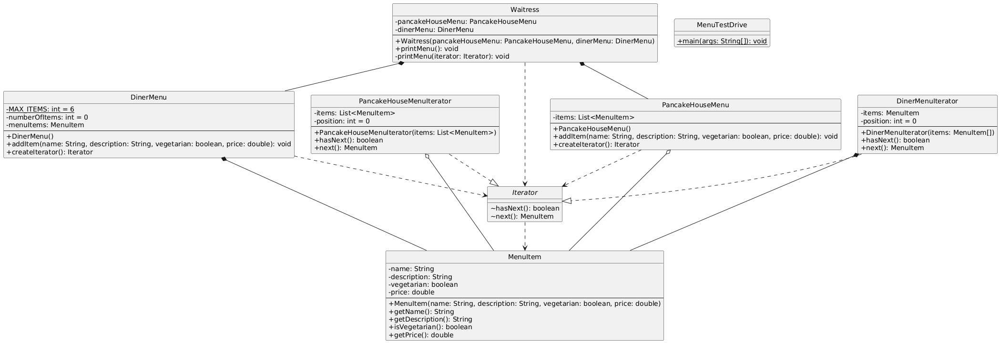
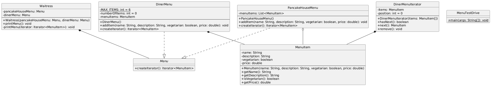
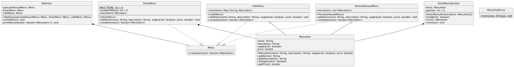
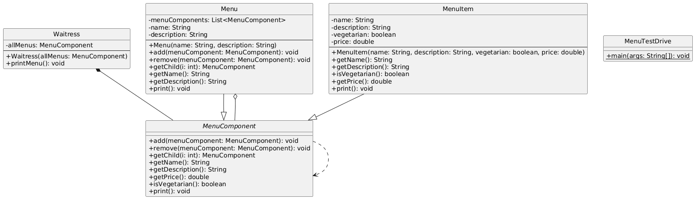

# ITERATOR DESIGN PATTERN
- Provide a way to access the elements of an aggregate object sequentially without exposing its underlying representation.

## Project 1: DinerMergeV1
- Basic menu merging without iterators.
- Directly accessing ArrayList (PancakeHouse) and array (Diner).

## Project 2: DinerMergeV2
- Introduces custom Iterator interface for uniform traversal of different menu types.

## Project 3: DinerMergeV3
- Refactors to use Java's built-in Iterator interface for standard iteration.

## Project 4: DinerMergeV4
- Adds third menu (CafeMenu) to demonstrate Iterator pattern scalability.

# COMPOSITE DESIGN PATTERN
- Compose objects into tree structures to represent part-whole hierarchies.
- Composite lets clients treat individual objects and compositions of objects uniformly.

## Project 5: DinerMergeV5
- Implements Composite pattern with MenuComponent for hierarchical menu structures.
